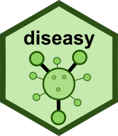

# diseasy <a href="https://ssi-dk.github.io/diseasy/"></a>
[](https://CRAN.R-project.org/package=diseasy)
[](https://github.com/ssi-dk/diseasy/actions/workflows/R-CMD-check.yaml)
[](https://codecov.io/gh/ssi-dk/diseasy)

Leveraging combinatorial building for ensemble forecasting in disease modelling

## The power of combinations
`diseasy` is framework for disease modelling that is built around the philosophy of combinatorial building.
Even from a small number of modules, an ensemble consisting of a vast array of disease models can be constructed by combining individual modules.

## The power of ensembles
Ensemble models of disease spread typically outperforms individual models in terms of robust and accurate forecasts.
With `diseasy`, ensemble models are leveraged to support evidence-based decision-making and pandemic preparedness.

## Installation

You can install the development version of `diseasy` from [GitHub](https://github.com/) with:

``` r
# install.packages("devtools")
devtools::install_github("ssi-dk/diseasy")  # Use "ssi-dk/diseasy@*release" to install the latest release version
```
