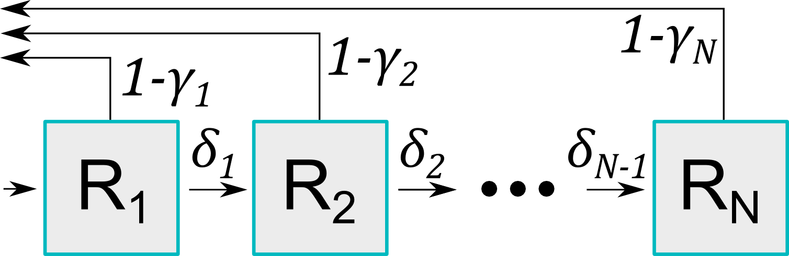

```{r, include = FALSE}
knitr::opts_chunk$set(
  collapse = TRUE,
  comment = "#>"
)
```

```{r setup}
library(diseasy)
```

```{r options, include = FALSE}
# Create a cache for this vignette since the examples take a long time to generate
# We will destroy the cache if the source code for `DiseasyImmunity` changes
cache <- cachem::cache_disk(dir = "vignette_data/cache/diseasy-immunity")

r6_hash <- \(r6_generator) {
  c(
    "public_methods",
    "public_fields",
    "private_methods",
    "private_fields",
    "active"
  ) |>
    purrr::map(~ purrr::pluck(r6_generator, .x)) |>
    purrr::reduce(c) |>
    hash_environment()
}

source_code_hash <- c(DiseasyBaseModule, DiseasyImmunity) |>
  purrr::map(r6_hash) |>
  rlang::hash()

if (!identical(source_code_hash, cache$get("source-code-hash"))) {
  if (interactive()) {
    cache$reset()
    cache$set("source-code-hash", source_code_hash)
  } else {
    stop(
      glue::glue(
        "Cache should not reset (source_code_hash: {source_code_hash})",
        " - Please run `diseasy-immunity.Rmd` locally and commit the updated cache."
      )
    )
  }
}


withr::local_options(
  "diseasy.logging" = FALSE,
  "diseasy.cache" = cache
)
```

# Introduction
The `?DiseasyImmunity` is a module designed to implement various models for the waning of immunity against a disease.

# Configuring the module
The module can be initialized without setting any parameters, with the following code:
```{r initialization}
im <- DiseasyImmunity$new()
```

# Inspecting the module
By default, the module initializes with the `no_waning` model (that is, constant, perfect immunity) stored under the
target "infection".

To check the currently set targets and associated models, you can use the following code.
```{r model}
im$model
```
This returns a `named list()` where the named target are modelled by the corresponding function.


To see the available waning models within the module, query the module as shown below:
```{r available_models}
im$available_waning_models
```

# Setting a waning model in the module
The input for the predefined waning models include:

- `target`: The specific aspect towards which immunity is waning, such as "infection".
- `time_scale`: A characteristic time scale, which defines the period until when the immunity is significantly waning.
  Note that the `no_waning` model does not have a time scale parameter.

The name of the chosen target is arbitrary within the context of the `?DiseasyImmunity` module, but models within the
`diseasy` framework may expect named targets such as "infection", "hospitalisation", or "death".

Here is an example of how to set the exponential waning model.
```{r setting the models}
im$set_sigmoidal_waning(time_scale = 9, target = "infection")
```
To inspect that the model has been set correctly use `im$model`

To visualize the model, the plot function provided by the module can be used:
```{r plot_1, fig.alt = "Visualisation of a exponentially waning immunity against infection."}
plot(im)
```

Besides the predefined functions, you can also create a custom waning function.

The input for the custom waning function includes:

- `custom_function`: A function defining how immunity wanes over time.
  It should take time (t) as a parameter and also include `time_scale` in the function expression.
- `time_scale`: A characteristic time scale, which defines the period until when the immunity is significantly waning.
- `target`: The specific aspect towards which immunity is waning, such as e.g. infection, hospitalisation, or death.
- `name`: A name for the custom function, used for identification. Default is "custom_waning".

Here is an example of setting a custom waning function:
```{r custom waning function}
im$set_custom_waning(
  custom_function = \(t) 0.8 * exp(- (t / time_scale)^2) + 0.2,
  time_scale = 12,
  target = "hospitalisation",
  name = "gaussian_waning"
)
```

To visualize all the functions in the model, use the same plot function as above:
```{r plot_2, fig.alt = "Visualising the additional custom (sigmoid) waning immunity against hospitalisation."}
plot(im)
```

## Setting the waning model programmatically
`?DiseasyImmunity` also provides the `?DiseasyImmunity$set_waning_model()` function which allows greater flexibility
when configuring various waning models within the module.

`?DiseasyImmunity$set_waning_model()` provides a single entry-point for setting the predefined waning models or a
custom waning function based on the specified `model` and `target`.

If `model` is a `function`, it will be set as a custom waning function via `?DiseasyImmunity$set_custom_waning()`.
If instead it is `character`, the corresponding to `$set_<model>()` method will be used to set the waning model.

Input for both predefined models and custom waning functions can be passed to the `?DiseasyImmunity$set_waning_model()`
as additional arguments.

An example of how to set they two model examples from above, using the `?DiseasyImmunity$set_waning_model()` is as
follows:
```{r set waning models function}
im$set_waning_model(model = "sigmoidal_waning", time_scale = 9, target = "infection")
im$set_waning_model(
  model = \(t) 0.8 * exp(- (t / time_scale)^2) + 0.2,
  time_scale = 18,
  target = "hospitalisation",
  name = "gaussian_waning"
)
```

# Changing the time scale
It is also possible to change the characteristic time scale after setting the model.

This is done via the method `?DiseasyImmunity$set_time_scales()` which takes a named list as input and changes time
scales of waning functions associated with the named targets.

Following is an example of how to change the time scale for the two targets in the current models.
```{r setting the time scale}
im$set_time_scales(list("infection" = 6, "hospitalisation" = 18))
```

# Approximating to a compartmental model
`?DiseasyImmunity` can also provide the approximations of the waning models for compartmental ODE models.
(e.g. the Susceptible-Infected-Recovered-Susceptible (SEIR) models).

The approximation assumes the model has a number of sequential R compartments and then provides the transition rates
and associated risks for each compartment that best approximates set waning functions (see Figure 1 for a illustration).



Some definitions:

- Flow between compartments: The transition rate between compartments $m$ and $m+1$ is defined as $\delta_m$.
- Risk associated with compartments: The protective effect associated with compartment $m$ is defined as $\gamma_m$,
  which represents the probability of not becoming infected when exposed to an infected individual.
- In `?DiseasyImmunity` we operate with multiple targets, so we have a set of `\gamma_m` values for each target, but
  only a single set of transition rates `\delta_m`.

Combined, these rates and risks define a population level waning immunity. From the waiting time distributions,
hypoexponential in general, Erlang distributed if all rates are equal, we can compute the probability to occupy each
compartment at time $t$ after entering the first compartment at $t = 0$. We denote this probability as
$\textrm{P}_m(t \;|\;\vec{\delta})$. Given this occupancy probability, we can parametrise the approximated waning
immunity of the $k$th target as:

$$
\tilde{f}^k(t) \equiv \sum_{m = 1}^M \gamma_m^k\; \textrm{P}_m(t\;|\;\vec{\delta})
$$

Three approaches are available for determining the transition rates, $\delta_m$, and protective effect, $\gamma_m$,
that best approximates the set waning functions:

- Method 1 (`free_gamma`): $\gamma_m$ values are allowed to vary freely, while the $\delta_m$ rates are equal
  between compartments ($\delta_m = \delta$).

- Method 2 (`free_delta`): $\gamma_m$ values are linearly distributed from $f(0)$ to $f(\infty)$,
  and $\delta_m$ are allowed to vary freely.

- Method 3 (`all_free`): Both $\gamma_m$ and $\delta_m$ are allowed to vary freely.


In addition, there are three strategies for the initial guess of the parameters:

- Strategy 1 (`naive`): The initial guess that `\gamma_m` values are linearly distributed from $f(0)$ to $f(\infty)$,
  while the `\delta_m` values are assumed to be set by the reciprocal of the median time scale of the targets.

- Strategy 2 (`recursive`): The initial guess is based on the previous optimisation results for `M - 1`.

- Strategy 3 (`combination` - only for the `all_free` method): The initial guess uses the `free_gamma` solution using
  its corresponding default strategy.


The parameters of the approximation are then determined through the use of an optimiser
(controllable via the `optim_control` argument), which minimises the sum of the square roots of the differences between
the target and approximation functions plus additional penalties for the parameters:

$$
 \textrm{objective} = \sum_{k = 1}^K \sqrt{\int_0^\infty \left( f^k(t) - \tilde{f}^k(t) \right)^2} + \textrm{penalty}
$$

where the penalties are controllable via the `monotonous` and `individual_level` arguments:

- `monotonous`: A penalty for non-monotonous $\gamma_m$ values is added.

- `individual_level`: A penalty variation in $\gamma_m$ and $\delta_m$ values are added.
   The population level waning immunity may be smoothly changing for a set of parameters, but the instantaneous change
   in immunity between two neighbouring compartments may be large. This penalty can be added to avoid such behaviour.


The input for the `?DiseasyImmunity$approximate_compartmental()` function includes:

- `method`: One of the methods from above - "free_gamma", "free_delta" or "all_free".
- `strategy`: One of the strategies from above - "naive", "recursive" or "combination" (optional).
- `M`: The number of compartments to use for the approximation.
- `optim_control`: A configuration of the optimiser (optional). The approximation to the compartmental model is a hard
  optimisation problem where the choice of the optimiser can have a significant impact on the quality of the fit.
  See `vignette("diseasy-immunity-optimisation")` for more information on the optimiser configuration.

In this example, the module contains the infection and hospitalisation targets defined earlier, which will be
approximated.
```{r approximate compartmental}
im$approximate_compartmental(method = "free_gamma", M = 4)
```

To visualize how the approximations compare to the target functions, the plot function can be used.
Simply specify the approach and the number of compartments (`M`).
The plot will display both the approximations and the target functions for comparison.
```{r plot approximation, fig.alt = "Visualisation of the approximations of the waning models."}
im$plot(method = "free_gamma", M = 4)
```

# Compartment selection (elbow curve method)
The accuracy of the approximation can be influenced by the number of compartments (`M`) used in the model.
Therefore it is crucial to select the right `M` as too few compartments can lead to poor approximation,
while too many compartments can lead to unnecessary computational time without significant improvement in accuracy.
The elbow curve method is employed to determine the appropriate `M` for the models.
Each approach is executed across a range of `M` values, and the resulting objective function values are returned as
`value` from the `?DiseasyImmunity$approximate_compartmental()` function.

In the example below, we have a case where the "all_free" method out performs the other methods, but
this is not generally true. We find that the "all_free" method can be the best if the problem contains
multiple time scales, but often performs no better than "free_gamma".
For more examples, see the optimisation vignette (`vignette("diseasy-immunity-optimisation")`).

```{r elbow curve method, fig.alt = "Increasing number of compartments has diminishing returns on the error.", eval = rlang::is_installed(c("ggplot2", "tibble"))}
# Prepare the data
M_seq <- seq(from = 1, to = 5, by = 1)
methods <- c("free_gamma", "free_delta", "all_free")
im$set_custom_waning(
  custom_function = \(t) sum(exp(- (1:3) * t / time_scale)) / 3,
  time_scale = 20,
  target = "infection"
)

# Run each function
results <- tidyr::expand_grid(
  method = methods,
  M = M_seq
) |>
  purrr::pmap(
    \(method, M) {
      im$approximate_compartmental(method = method, M = M)
    },
    .progress = interactive()
  ) |>
  purrr::list_transpose() |>
  tibble::as_tibble()

# Plot
ggplot2::ggplot(results, ggplot2::aes(x = M, y = value, color = method)) +
  ggplot2::geom_line(linewidth = 1) +
  ggplot2::labs(x = "M", y = "Error") +
  ggplot2::coord_cartesian(xlim = c(1, max(results$M)), expand = FALSE)
```

```{r check_cache, include = FALSE, eval = rlang::is_installed(c("ggplot2", "tibble"))}
if (!interactive() && cache$size() != (2 + max(M_seq) * length(methods))) {
  stop(
    glue::glue(
      "Unexpected number of cache items (cache size: {cache$size()})",
      " -- hashing issue?"
    )
  )
}
```

```{r cleanup, include = FALSE}
if (exists("im")) rm(im)
gc()
```
